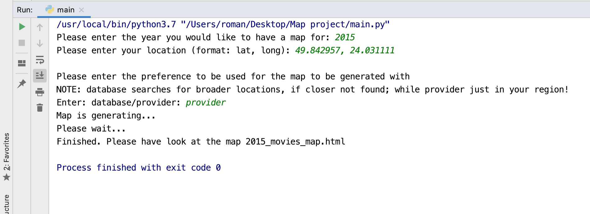

# Movie Locations Map

Creates an HTML map file with closest movie locations next to you

## Getting Started

These instructions will get you started and running on your local machine. Enjoy my program!

### Prerequisites

In oder to start, you need to install following libraries on your local machine.

```
pip install geopy
pip install folium
```

### To run the program

A step by step guide to create your HTML map

```
Run the main.py file.
Enter the year you would like to have a map for.
Enter your location in the following format: latitude, longitude.
Enter how you would like your map to be generated (using map provider or database).
Wait for the map to be generated in the program's directory.
```


## Running the program
Process of creating an HTML map using Terminal


Lauching previously created HTML map in Google Chrome browser


### Summary

All in all, this program is a great way to explore the most closest fiming locations to you, and movies which were fimed there.
Also there is an additional layer, so you can see all world capitals.
Enjoy the program!


## Authors

* **Roman Bilets** - *Initial work* - UCU IT&BA Student


## License

This project is licensed under the UCU License.
All rights reserved.


